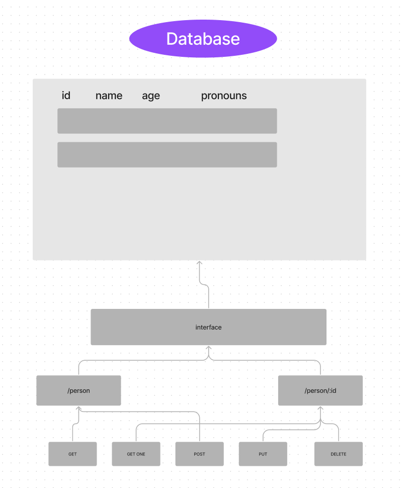

# LAB - 03 api-server

### Deployment Test

#### Author: Elaine Huynh
 - tests report

 #### Setup
    **.env** requirements
    - PORT - 3001

    Running the app
    - npm start
    - Endpoint: /plant (with or without name query)
        - returns array with plant collection data

#### Tests
    - Unit Tests: npm run test
    - Lint Tests: npm run lint

#### UML

## Links
- Latest PR on GitHub: https://github.com/nurselaine/api-server/pull/4
- Heroku link: https://nurselaine-api-server.herokuapp.com/
